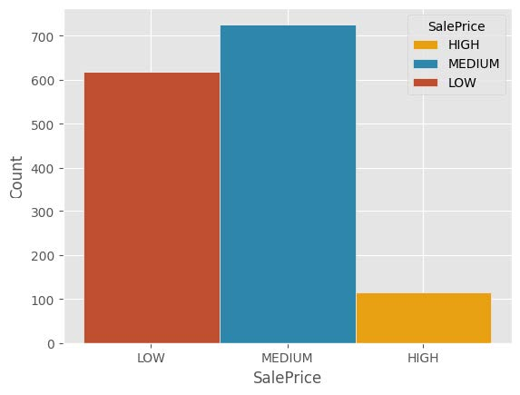
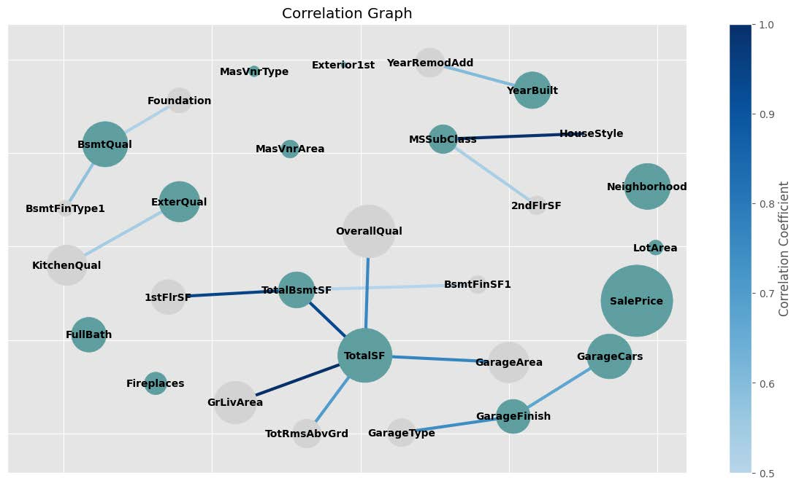
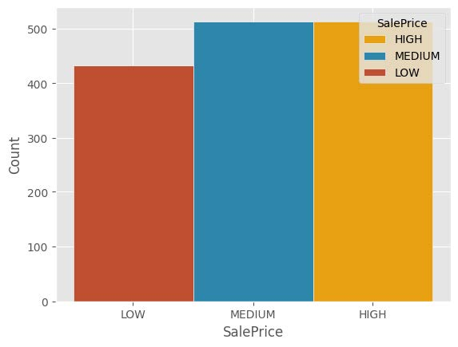
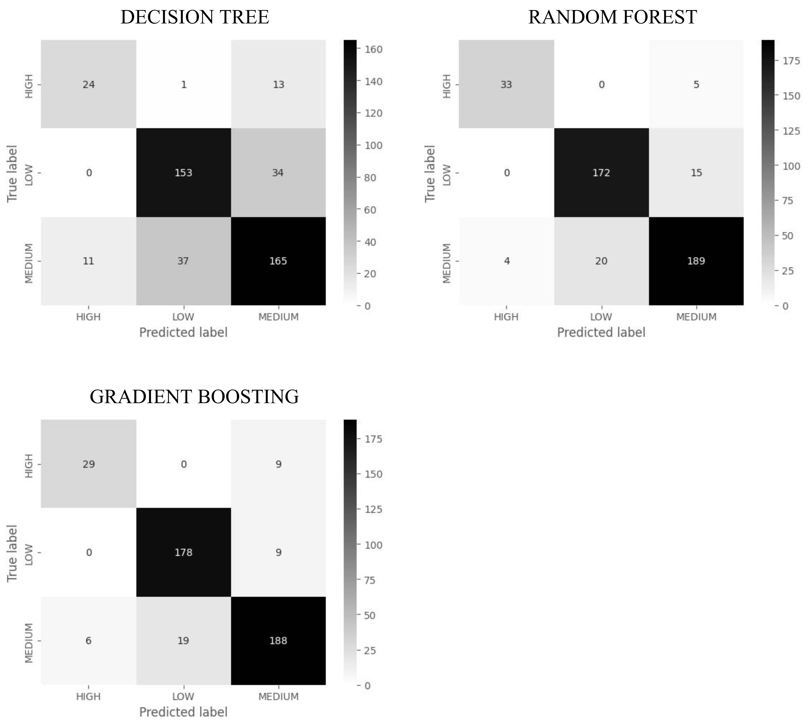
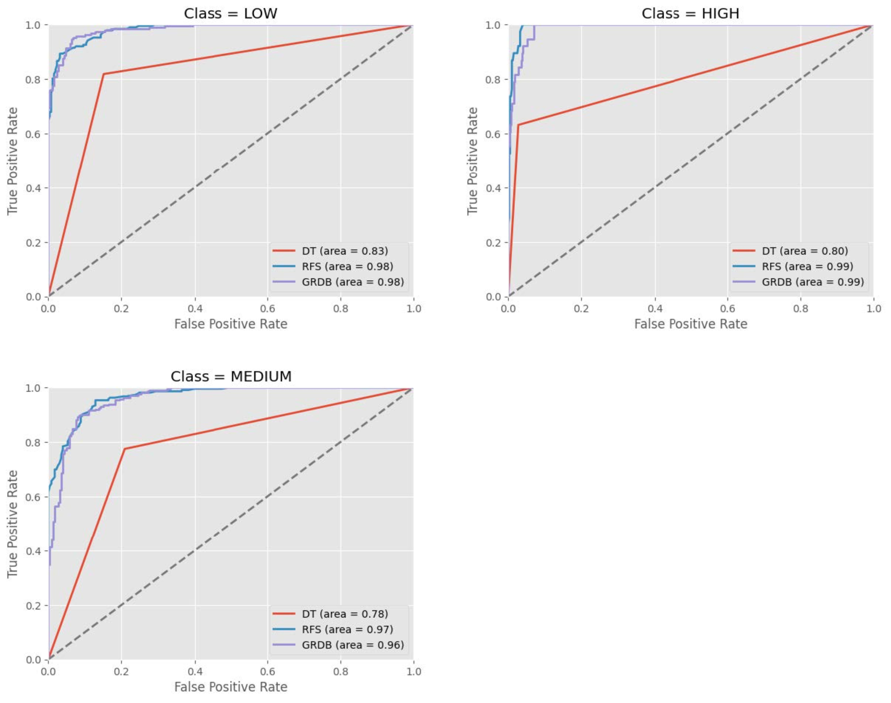

# House Pricing Prediction

This project involves building machine learning models to predict house prices in Ames, Iowa, using a dataset introduced by Dean De Cock. The dataset includes comprehensive details about residential properties, and the goal is to create a reliable predictive tool to assist real estate agents and enhance the decision-making process for property pricing. This project was part of the Kaggle competition [House Prices: Advanced Regression Techniques](https://www.kaggle.com/competitions/house-prices-advanced-regression-techniques).

## Problem Definition

The real estate industry requires accurate property valuation to match buyers with properties that suit their budgets. This project addresses this need by predicting house prices based on various features. The objectives are to:
- Classify properties into appropriate price ranges.
- Minimize errors, especially underestimating house prices.
- Enhance customer satisfaction by aligning property suggestions with budgets.

For further details, see the **Business Understanding** section in the [report](docs/report.pdf).

## Data Understanding

The dataset consists of 1460 rows with 81 features, covering qualitative and quantitative aspects of residential properties. Key observations:
- The dataset is **imbalanced**, with fewer high-priced houses compared to medium- and low-priced ones:

  

- Strong correlations exist between features like **Total Square Footage**, **Overall Quality**, **Neighborhood**, and the target variable (sale price). Below is the **correlation graph** highlighting key relationships and redundancies among features:

  

Refer to the **Data Understanding** section in the [report](docs/report.pdf) for additional insights.

## Data Preparation

1. **Feature Selection:** Attributes were selected based on statistical significance and their relationship to the target feature.
2. **Data Cleaning:** Addressed null values and inconsistencies, e.g., replacing "NA" with appropriate substitutes based on context.
3. **Resampling:** To address the imbalanced dataset, the **SMOTENC** resampling technique was applied to the minority class (high-priced houses). Below is the resulting distribution:

   

4. **Normalization & Aggregation:** 
   - Features were normalized using `StandardScaler`.
   - Aggregated attributes like **TotalSF**, combining square footage across different property areas.

For more details, see the **Data Preparation** section in the [report](report.pdf).

## Implemented Models

We tested various machine learning models, including:
- **Decision Tree**
- **Random Forest**
- **Gradient Boosting**
- **Naive Bayes**
- **Neural Network**

### Best Performers:
- **Random Forest:** Highest accuracy and balanced prediction across classes.
- **Gradient Boosting:** Comparable accuracy with faster prediction times.

| Model             | Accuracy (avg) | Precision (avg) | Recall (avg) | F1-Score (avg) |
|--------------------|----------|-----------|--------|----------|
| Decision Tree      | 0.79     | 0.77      | 0.76   | 0.75     |
| **Random Forest**  | **0.85** | **0.84**  | **0.82**   | **0.82**  |
| Gradient Boosting  | 0.85     | 0.83      | 0.82| 0.82    |

**Confusion Matrices:**
- **Random Forest**: Robust identification of high-value properties.
- **Gradient Boosting**: Precise classification for low-value properties.

**ROC Curves for Best Models:**  
The models demonstrate strong performance, particularly for the high-price class due to resampling.

Refer to the **Modelling and Validation** section in the [report](report.pdf) for more details on model evaluation, tuning and performance.

---

## Results and Evaluation

The Random Forest model demonstrated superior performance in terms of:
- Accuracy: 85%
- Balanced classification across price ranges.
- Practical prediction times suitable for real-world application.

Gradient Boosting offered comparable quality but excelled in speed for predictions. Both models benefited from resampling techniques to balance the imbalanced dataset.

For additional analysis, refer to the **Evaluation** section in the [report](report.pdf).
